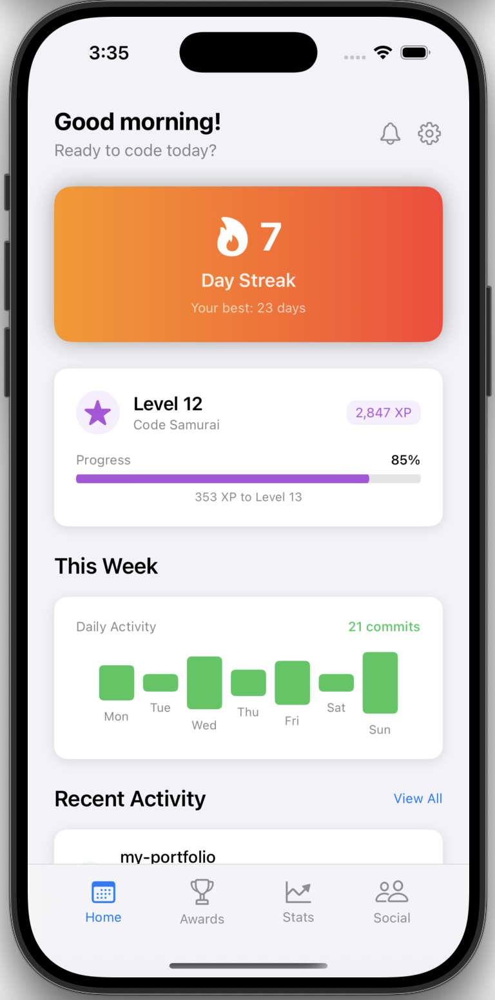

# GitStreak - iOS

A native iOS app that gamifies your GitHub activity with real-time streak tracking, achievements, and progress visualization. Connect your GitHub account to track your coding streaks and level up your development journey.

## Screenshots

<p align="center">
  
</p>


## ✨ Features

### 🔥 Core Features
- **Real GitHub Integration** - Connect with Personal Access Token for live data
- **Daily Streak Tracking** - Monitor your consecutive days of GitHub commits
- **Level System** - Progress through levels based on your coding activity
- **XP & Progress** - Earn experience points for each commit and contribution
- **Weekly Activity Chart** - Visual representation of your current week's activity
- **Recent Commits** - See your latest GitHub commits in real-time
- **Achievements System** - Unlock badges for reaching coding milestones
- **Secure Token Storage** - GitHub tokens stored securely in iOS Keychain

### 📱 iOS-Specific Features
- **Native SwiftUI Interface** - Smooth, responsive iOS design
- **Tab-Based Navigation** - Intuitive iOS navigation pattern (Home, Awards, Stats, Social)
- **Dynamic UI** - Adapts to different screen sizes and orientations
- **iOS Design Language** - Follows Apple's Human Interface Guidelines
- **Secure Authentication** - GitHub tokens stored in iOS Keychain for security
- **Settings Integration** - Easy GitHub account connection and management

## 🛠 Tech Stack

- **Framework:** SwiftUI
- **Language:** Swift
- **Platform:** iOS 17.5+
- **Architecture:** MVVM pattern with ObservableObject
- **API Integration:** GitHub REST API v3
- **Security:** iOS Keychain for secure token storage
- **Data Handling:** Real-time GitHub data with fallback to mock data

## 📁 Project Structure

```
GitStreak/
├── GitStreakApp.swift          # App entry point with @main
├── ContentView.swift           # Main container with tab navigation, view routing, and SettingsView
├── Models/
│   └── GitStreakData.swift     # Data models, GitHubService, and ObservableObject classes
└── Views/
    ├── StreakCardView.swift    # Current streak display with gradient background and loading state
    ├── LevelProgressView.swift # Level and XP progress visualization
    ├── WeeklyActivityView.swift # Weekly commit activity chart
    ├── RecentActivityView.swift # Recent commits list
    ├── AchievementsView.swift  # Achievement badges display
    └── TabBarView.swift        # Custom tab bar with 4 tabs (Home, Awards, Stats, Social)
```

## 🚀 Getting Started

### Prerequisites
- Xcode 14.0 or later
- iOS 17.5+ device or simulator
- macOS Big Sur or later
- GitHub Personal Access Token (for real data integration)

### Installation

1. **Clone the repository**
   ```bash
   git clone <your-repo-url>
   cd gitstreak
   ```

2. **Open in Xcode**
   ```bash
   open GitStreak.xcodeproj
   ```

3. **Select your target**
   - Choose an iOS Simulator (e.g., iPhone 15 Pro) from the device dropdown
   - Or connect your physical iOS device

4. **Build and run**
   - Press `⌘+R` or click the play button
   - The app will build and launch on your selected device/simulator

5. **Connect your GitHub account (optional)**
   - Tap the gear icon in the top right to open Settings
   - Generate a Personal Access Token at [GitHub Settings](https://github.com/settings/tokens)
   - Grant `repo` and `user` scopes to the token
   - Paste your token in the app to see real GitHub data

### Troubleshooting

**"Build only device cannot be used" error:**
- Make sure you've selected an iOS Simulator, not a "Build Only" device
- Go to Window → Devices and Simulators to manage available simulators

## 🎯 Current Status

This is a **fully functional native iOS app** with real GitHub integration and secure authentication.

### ✅ Completed Features
- [x] **GitHub Integration** - Full GitHub API integration with Personal Access Token authentication
- [x] **Secure Token Storage** - GitHub tokens stored securely in iOS Keychain
- [x] **Real-time Data** - Live streak calculation, commit tracking, and activity monitoring
- [x] **Weekly Activity Display** - Current week commit visualization (Monday-Sunday)
- [x] **Settings & Authentication** - Complete GitHub account connection flow
- [x] **Native SwiftUI interface** - Smooth, responsive iOS design
- [x] **Tab-based navigation** - Home (fully functional), Awards, Stats, Social tabs
- [x] **Streak tracking display** - Real GitHub commit streak calculation
- [x] **Level progress visualization** - XP and level system based on GitHub activity
- [x] **Recent activity feed** - Latest GitHub commits with timestamps
- [x] **Achievements system UI** - Achievement badges with unlock conditions
- [x] **Responsive design** - Optimized for all iOS screen sizes
- [x] **Error handling & fallback** - Graceful fallback to mock data when not authenticated

### 🔄 Future Enhancements
- [ ] **Enhanced Stats Tab** - Detailed analytics and contribution graphs
- [ ] **Awards Tab Completion** - Interactive achievement showcase
- [ ] **Social Features** - Share streaks and compare with friends
- [ ] **Push Notifications** - Streak reminders and goal notifications
- [ ] **Haptic Feedback** - Enhanced interaction feedback
- [ ] **Widget Support** - iOS home screen streak widget
- [ ] **Dark Mode Optimization** - Enhanced dark theme experience
- [ ] **Advanced GitHub Features** - Pull requests, issues, and contribution types


## 📱 Supported Platforms

- iOS 17.5+
- iPhone (all sizes, from iPhone SE to iPhone 15 Pro Max)
- iPad (optimized for tablet experience)
- iOS Simulator

## 🔐 Security & Privacy

- **Secure Token Storage**: GitHub Personal Access Tokens are stored securely in iOS Keychain
- **No Data Collection**: Your GitHub data stays on your device
- **Token Validation**: Comprehensive token format validation before authentication
- **Error Handling**: Graceful handling of authentication failures and network issues


## 🙏 Acknowledgments

- Inspired by GitHub's contribution graph
- Built with Apple's SwiftUI framework
- Icons from SF Symbols
- GitHub REST API for real-time data

## 📝 Recent Updates

- **v1.2** - Fixed weekly activity display not showing commits
- **v1.1** - Added GitHub API integration with secure authentication
- **v1.0** - Initial release with SwiftUI interface and mock data

---

**Built with ❤️ using SwiftUI and GitHub API**