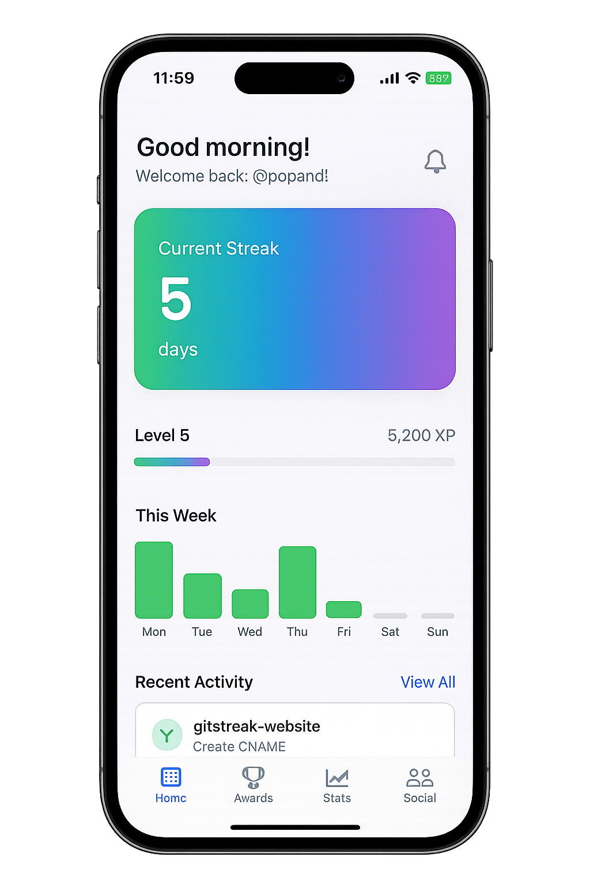

# GitStreak - iOS

GitHub Tracker, native iOS app that gamifies your GitHub activity with streaks, achievements, and progress tracking. Built with SwiftUI for a native iOS experience.

## Screenshots

<p align="center">
  
</p>


## ✨ Features

### 🔥 Core Features
- **Daily Streak Tracking** - Monitor your consecutive days of GitHub activity
- **Level System** - Progress through levels based on your coding activity
- **XP & Progress** - Earn experience points for each commit and contribution
- **Weekly Activity Chart** - Visual representation of your daily coding activity
- **Recent Commits** - See your latest GitHub activity at a glance
- **Achievements System** - Unlock badges for reaching milestones

### 📱 iOS-Specific Features
- **Native SwiftUI Interface** - Smooth, responsive iOS design
- **Tab-Based Navigation** - Intuitive iOS navigation pattern
- **Dynamic UI** - Adapts to different screen sizes and orientations
- **iOS Design Language** - Follows Apple's Human Interface Guidelines

## 🛠 Tech Stack

- **Framework:** SwiftUI
- **Language:** Swift
- **Platform:** iOS 14.0+
- **Architecture:** MVVM pattern
- **Data:** Mock data structure (ready for real API integration)

## 📁 Project Structure

```
GitStreak/
├── GitStreakApp.swift          # App entry point
├── ContentView.swift           # Main container view with tab navigation
├── Models/
│   └── GitStreakData.swift     # Data models and mock data
└── Views/
    ├── StreakCardView.swift    # Daily streak display card
    ├── LevelProgressView.swift # Level and XP progress
    ├── WeeklyActivityView.swift # Weekly activity chart
    ├── RecentActivityView.swift # Recent commits list
    ├── AchievementsView.swift  # Achievements display
    └── TabBarView.swift        # Custom tab bar component
```

## 🚀 Getting Started

### Prerequisites
- Xcode 14.0 or later
- iOS 14.0+ device or simulator
- macOS Big Sur or later

### Installation

1. **Clone the repository**
   ```bash
   git clone <your-repo-url>
   cd gitstreak
   ```

2. **Open in Xcode**
   ```bash
   open GitStreak.xcodeproj
   ```

3. **Select your target**
   - Choose an iOS Simulator (e.g., iPhone 15 Pro) from the device dropdown
   - Or connect your physical iOS device

4. **Build and run**
   - Press `⌘+R` or click the play button
   - The app will build and launch on your selected device/simulator

### Troubleshooting

**"Build only device cannot be used" error:**
- Make sure you've selected an iOS Simulator, not a "Build Only" device
- Go to Window → Devices and Simulators to manage available simulators

## 🎯 Current Status

This is a **native iOS app** with mock data that demonstrates the UI and user experience. 

### ✅ Completed Features
- [x] Native SwiftUI interface
- [x] Tab-based navigation (Home, Awards, Stats, Social)
- [x] Streak tracking display
- [x] Level progress visualization
- [x] Weekly activity chart
- [x] Recent activity feed
- [x] Achievements system UI
- [x] Responsive design for all iOS screen sizes

### 🔄 Future Enhancements
- [ ] GitHub API integration for real data
- [ ] Push notifications for streak reminders
- [ ] Haptic feedback for interactions
- [ ] Widget support for iOS home screen
- [ ] Apple Watch companion app
- [ ] Dark mode optimization
- [ ] iCloud sync for user preferences


## 📱 Supported Platforms

- iOS 14.0+
- iPhone (all sizes)
- iPad (optimized for tablet experience)
- iOS Simulator


## 🙏 Acknowledgments

- Inspired by GitHub's contribution graph
- Built with Apple's SwiftUI framework
- Icons from SF Symbols

---

**Built with ❤️ using SwiftUI**